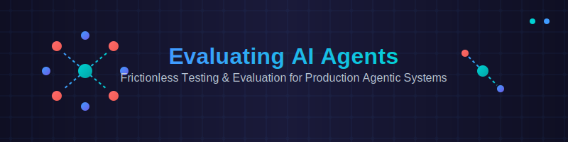

  

 
Combining Python Full Stack test framework with Evals.

Please see [https://evaluating-ai-agents.netlify.app/](https://evaluating-ai-agents.netlify.app/) for more information.

For the PyTest Full Stack Framework please see [https://pytest-cookbook.com/](https://pytest-cookbook.com/)

Alhtough this is a UV based project, you can run it as a standard `pip` project with the `requirements.txt` file and a `python -m venv venv` to set up a virtual environment if you want one.

## for UV

Make sure you have UV installed https://docs.astral.sh/uv/getting-started/installation/

Then `uv sync`.

`uv run uv_test.py`

## Tests

If you want to run all the template tests in the `tests` folder:

To run all tests, `uv run pytest -vs  --tb=no`. We use `--tb=no` as this supresses tracback which can be quite long in purposely designed error tests.

There are 3 purposely failed tests for demo purposes.

In 100 and 110 the tests will not be picked up by PyTest by default as the tests do not start with test_.

They need an OPENAI_API_KEY set in the environment so that the test can run.

Please see https://pytest-cookbook.com/ on how the PyTest Full Stack Framework works.

It is not needed for Evaluating AI Agents as these are code files outside of PyTest.

